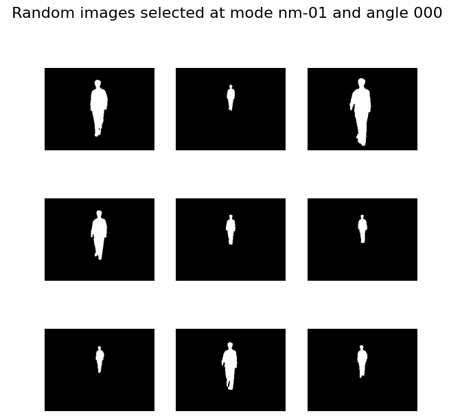
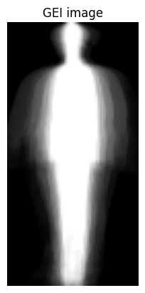
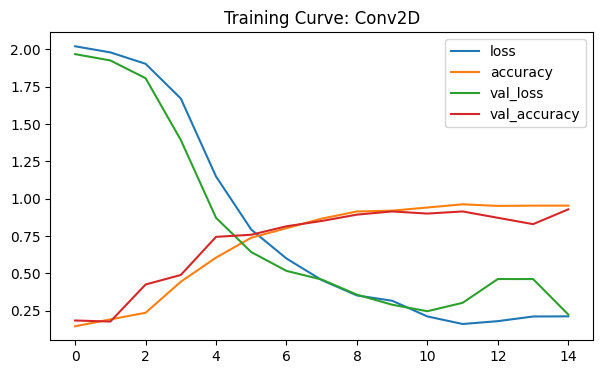

# Gait Recognition with Convolutional Neural Networks (CNNs)

## Project Description

This project focuses on **gait recognition**, a biometric technology that identifies individuals based on their walking patterns. By leveraging **Convolutional Neural Networks (CNNs)** and **Gait Energy Images (GEIs)**, the system analyzes the unique walking patterns of individuals and learns to differentiate between them. The project is designed to provide a complete tutorial, covering dataset preparation, model building, training, and evaluation.

The figure below illustrates a sample sequence of silhouette images and the corresponding Gait Energy Image (GEI) produced from them as used in the project.

#### Silhouette Images

#### Gait Energy Image



## Features

- **Gait Energy Image (GEI) Generation**: Compute and process GEIs from walking sequences.
- **Model Architectures**: Implements both Conv1D and Conv2D CNN architectures.
- **Model Training**: Train the model on GEIs to recognize individuals by their gait.
- **Model Evaluation**: Visualize model performance and analyze training/validation accuracy and loss.

## Technologies Used

- **Python**: Core programming language.
- **TensorFlow**: Deep learning framework used for building and training CNN models.
- **Matplotlib**: Visualization library for plotting training curves and results.
- **Scikit-Image**: Image processing library for handling and resizing images.
- **NumPy**: Library for numerical computations.

## Dataset

The dataset used in this project consists of **Gait Energy Images (GEIs)**, which are generated by averaging the silhouettes of individuals walking over a complete gait cycle. This dataset is processed into training and testing sets for model evaluation.

## Project Structure

```
├── Gait_Recognition_with_Convolutional_Neural_Networks.ipynb  # Main Jupyter notebook
├── README.md              # Project README
└── requirements.txt       # Project dependencies
```

## How to Run

You can run the project by downloading the Jupyter notebook and either running it locally on your computer or opening it directly in Google Colab.

[](https://colab.research.google.com/github/tettey-exploits/human_gait_recognition_with_cnns/blob/main/Gait_Recognition_with_Convolutional_Neural_Networks_IndabaX_Computer_Vision_Tutorial_Session.ipynb)

## Model Training

The model is trained using **GEIs** with a **80-20** train-test split. The following CNN architectures are explored:
- **Conv1D**: Simpler architecture for testing.
- **Conv2D**: More complex model capable of handling 2D GEIs with higher accuracy.

## Model Evaluation

After training, the model's performance is evaluated using:
- **Accuracy**: Percentage of correct predictions.
- **Loss**: Measures the error in prediction.
- **Training Curves**: Visualizations of training and validation accuracy and loss over epochs.

## Results

The trained CNN is able to distinguish between individuals based on their gait, achieving [mention key results, e.g. accuracy, etc.].



## Future Improvements

- **Model Optimization**: Test more advanced CNN architectures (e.g., ResNet).
- **Mobile Application**: Implement a mobile app for real-time gait recognition.
- **Expand Dataset**: Include more diverse walking patterns for better generalization.

## License

This project is licensed under the MIT License. See the [LICENSE](LICENSE) file for details.
